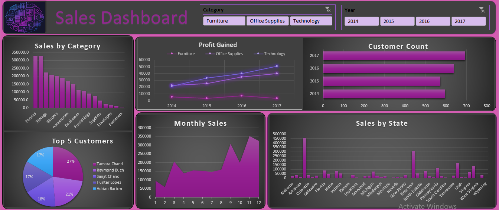

# 📈 Multi-Year Sales Performance Dashboard

An interactive Excel dashboard designed to analyze sales and profit trends across multiple years. It provides a clear view of performance by **category**, **customer**, **month**, and **state**, helping businesses uncover growth opportunities and optimize strategy.

## 🔧 Tools & Skills
- Excel (Pivot Tables, Charts, Slicers, Timelines)
- Dashboard design & layout
- Business intelligence & data storytelling

## 🎯 Objectives
- Track revenue, profit, and customer growth over time
- Identify top-performing categories and customers
- Analyze monthly trends and geographic distribution
- Enable dynamic filtering for deeper insights

## 📊 Key Features
- **KPIs:** Total Sales, Total Profit, Customer Count
- **Trend Analysis:** Profit over time by category
- **Customer Insights:** Top 5 customers by sales
- **Monthly Breakdown:** Sales by month
- **Geographic View:** Sales by U.S. state
- **Interactivity:** Category and Year slicers

## 🖼️ Dashboard Preview

## 📁 Files
- `Multi Year Sales Performance_Dashboard.xlsx` – interactive Excel dashboard  
- `Multi Year Sales Performance_Dashboard.pdf` – printable version  
- `image` – screenshots used in this README  

## 📝 Insights 
- **Technology** category shows consistent profit growth  
- **California** leads in total sales across all years  
- **Top customers** contribute significantly to revenue  
- **Sales peak** during Q4, indicating seasonal demand  

## 🚀 How to Use
1. Download the `.xlsx` file  
2. Open in Excel (2019 or later recommended)  
3. Use slicers to filter by category and year  
4. Explore trends and insights interactively  

## 🔒 Data Notice
This dashboard uses sample data for demonstration purposes. No personal or sensitive information is included.
